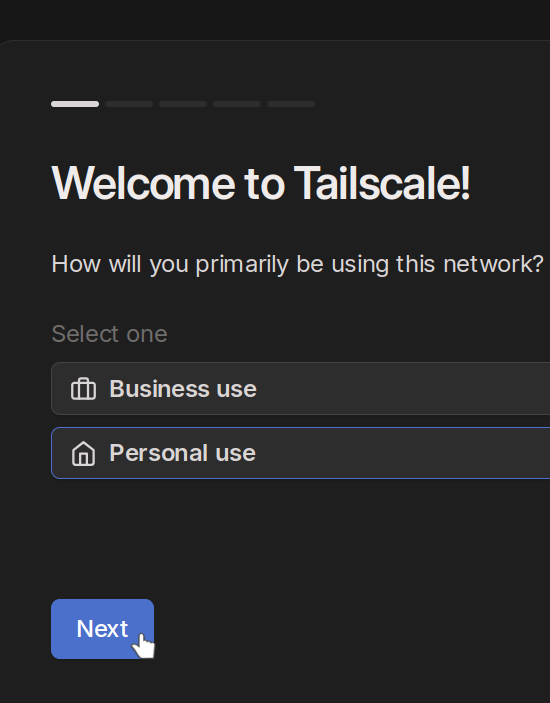

Это готовый докер, который позволяет развернуть [коробку Yougile](https://ru.yougile.com/self-hosted) с доступом в интернет 
при помощи [Tailsclale funnel](https://tailscale.com/kb/1223/funnel) при минимальной настройке. Конфигурация позволяет получить доступ с готовыми доменом и 
TLS-сертификатом через черый ip-адрес. 

Для начала вам надо зайти на [Tailscale](https://tailscale.com/) и зарегистрировать аккаунт:


Выбираем план для персонального использования:



Пропускаем шаг настройки, в нем нет необходимости:

В Access controls нужно вставить этот шаблон (он лишь добавляет tag для более простого управления):

```json
// Example/default ACLs for unrestricted connections.
{
	// Declare static groups of users. Use autogroups for all users or users with a specific role.
	// "groups": {
	//  	"group:example": ["alice@example.com", "bob@example.com"],
	// },

	// Define the tags which can be applied to devices and by which users.
	"tagOwners": {
		"tag:ssh":      ["autogroup:admin"],
		"tag:internet": ["autogroup:admin"],
	},

	// Define access control lists for users, groups, autogroups, tags,
	// Tailscale IP addresses, and subnet ranges.
	"acls": [
		// Allow all connections.
		// Comment this section out if you want to define specific restrictions.
		{"action": "accept", "src": ["*"], "dst": ["*:*"]},
	],

	// Define users and devices that can use Tailscale SSH.
	"ssh": [
		// Allow all users to SSH into their own devices in check mode.
		// Comment this section out if you want to define specific restrictions.
		{
			"action": "accept",
			"src":    ["autogroup:admin"],
			"dst":    ["autogroup:self"],
			"users":  ["root", "autogroup:nonroot"],
		},
	],
	"nodeAttrs": [
		{
			// Funnel policy, which lets tailnet members control Funnel
			// for their own devices.
			// Learn more at https://tailscale.com/kb/1223/tailscale-funnel/
			"target": ["autogroup:member", "tag:internet"],
			"attr":   ["funnel"],
		},
	],

	// Test access rules every time they're saved.
	// "tests": [
	//  	{
	//  		"src": "alice@example.com",
	//  		"accept": ["tag:example"],
	//  		"deny": ["100.101.102.103:443"],
	//  	},
	// ],
}

```

Внутри раздела DNS нужно:
1. Добавить любой nameserver (без этого не будет работать DNS):

2. 